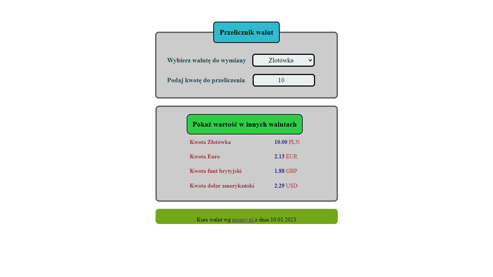

# Adrian Sikorski -currency-converter
## Currency - converter
https://radian31.github.io/currency-converter/

## Descript

Welcome to my currency calculator page. When creating it, I used the BEM method.
The website is operated by selecting the currency (zloty, Euro, British pound and US dollar) that we want to convert. Then, below, we provide the amount of this currency to be converted. The next step is to click on the currency conversion button (it changes its color to blue). After clicking, we can read the values of the converted currencies.

I attach a screenshot of the site.

